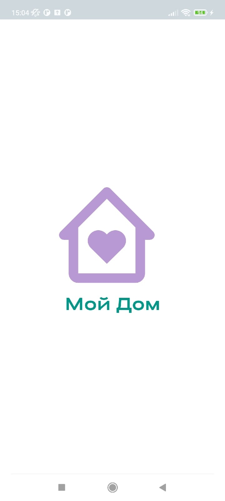
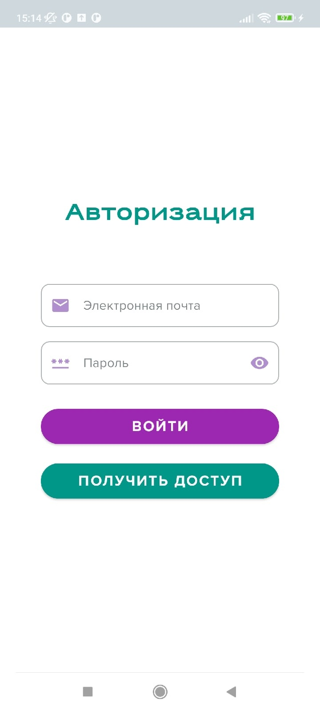
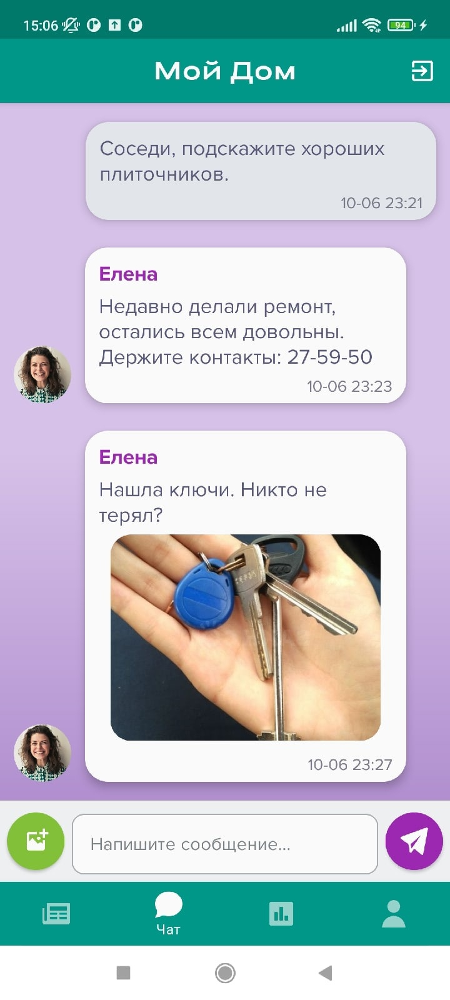
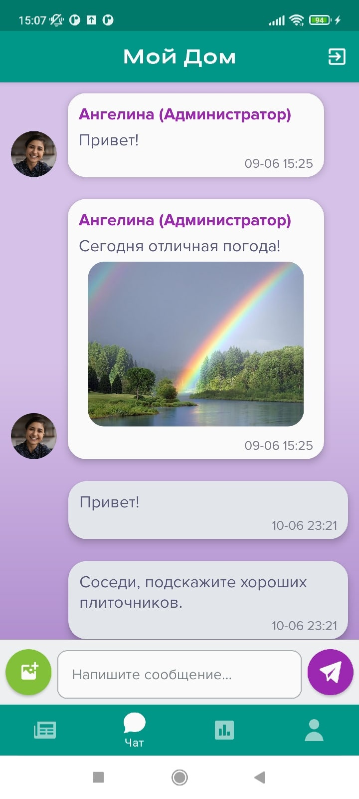
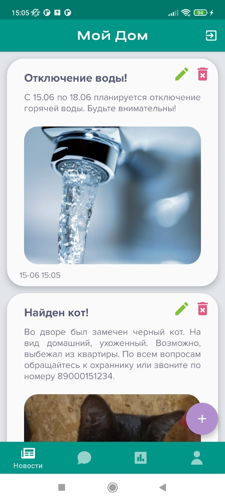
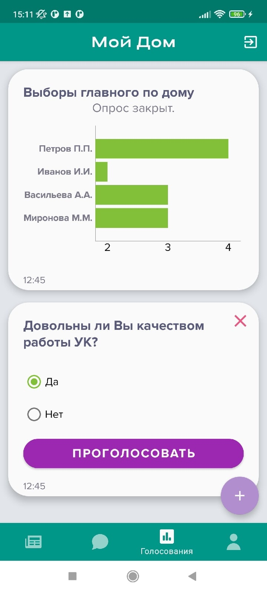

## My Home (Сообщество жильцов дома)
___

### Описание приложения
Приложение предоставляет инструменты для развития и поддержки сообщества жильцов дома.
1. Основные экраны приложения: лента новостей, общий чат, голосования.
2. Предусмотрена регистрация и авторизация пользователей через сервис Firebase Authentication.
3. Данные хранятся в NoSQL-СУБД Firestore.
4. Изображения хранятся в Firebase Cloud Storage.
5. В приложении есть несколько пользовательских ролей - у администраторов есть права для публикации новостей и голосований.
6. Реализован подход Single Activity.

### Стек технологий
1. Lang: Kotlin
2. Arch: Clean Architecture + MVVM
3. Async: Coroutines + Flow
4. Navigation: Navigation Component
5. DI: Hilt
6. Data: Firestore, Firebase Cloud Storage
7. Auth: Firebase Authentication

### Статус проекта
:heavy_check_mark: ~~Основной функционал и UI.~~

:white_medium_square: Пересмотр решений, доработка и рефакторинг.

Текущие цели:
1. Введение системы пуш-уведомлений
2. Рефакторинг
3. Пересмотр и переработка системы валидации
4. Введение domain-модели для обеспечения односторонней связи между слоями

### Основные экраны

Сплэш-скрин          |  Авторизация
:-------------------------:|:-------------------------:
|  

Чат                      |  Чат
:-------------------------:|:-------------------------:
| 

Лента новостей     |  Голосования
:-------------------------:|:-------------------------:
| 

